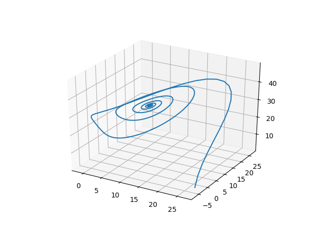

# Codes

## Lorenz Attractor
```julia
# numerical scheme from https://earth.esa.int/documents/973910/1002056/DA3.pdf/0cb2d2f6-3724-4089-9bc7-f97a2b4c4cdd
using PyPlot

σ,ρ,β = 10, 28, 8/3
function one_step(x, y, z)
    xx = x + σ*Δt/2*(2*(y-x)+Δt*(ρ*x-y-x*z) - σ*Δt*(y-x))
    yy = y + Δt/2 * (ρ*x-y-x*z+ρ*(x+σ*Δt*(y-x))-y
        -Δt*(ρ*x-y-x*z)
        -(x+σ*Δt*(y-z))*(z+Δt*(x*y-β*z)))
    zz = z + Δt/2*(x*y-β*z 
        + (x+Δt*σ*(y-x))*(y+Δt*(ρ*x-y-x*z))
        -β*z -Δt*(x*y-β*z))
    return [xx; yy; zz]
end

x0 = [26.61;-2.74;0.95]
T = 5
NT = 500
Δt = T/NT
X = zeros(3,NT+1)
X[:,1] = x0
for i = 1:NT
    X[:,i+1]= one_step(X[:,i]...)
end
plot3D(X[1,:], X[2,:], X[3,:])
```



## Hypothesis Testing for Normality
```julia
using Statistics
using LinearAlgebra
using Distributions

# https://www.stat.pitt.edu/sungkyu/course/2221Fall13/lec3.pdf
function score(X::Array{Float64, 2}; μ0::Union{Missing,Array{Float64,1}}=missing, Σ::Union{Missing,Array{Float64, 2}}=missing)
    n = size(X,1)
    p = size(X,2)
    if ismissing(μ0)
        μ0 = zeros(p)
    end
    if ismissing(Σ)
        Σ = I(p)
    end
    S = zeros(p,p)
    Xbar = mean(X, dims=1)[:]
    for i = 1:n
        S += (X[i,:]-Xbar)*(X[i,:]-Xbar)'
    end
    S /= n 
    W1 = n*(Xbar-μ0)'*inv(Σ)*(Xbar-μ0)
    W2 = -n*log(det(inv(Σ)*S))-n*p+n*tr(inv(Σ)*S)
    b1p = 0.0
    b2p = 0.0
    invS = inv(S)
    for i = 1:n
        for j = 1:n
            b1p += ( (X[i,:]-Xbar)'*invS*(X[j,:]-Xbar) )^3
        end
    end
    for i = 1:n
        b2p += ( (X[i,:]-Xbar)'*invS*(X[i,:]-Xbar) )^2
    end
    b1p /= n^2
    b2p /= n
    z1 = n/6*b1p
    z2 = (b2p-(p*(p+2)*(n-1))/(n+1))/sqrt(8*p*(p+1)/n)
    return W1, W2, z1, z2
end

function pvalue(X::Array{Float64, 2})
    W1, W2, z1, z2 = score(X)
    n = size(X,1)
    p = size(X,2)
    
    p1 = 1-cdf(Chisq(p), W1)

    ν = div(p*(p+1),2)
    p2 = 1-cdf(Chisq(ν), W2)

    ν = div(p*(p+1)*(p+2), 6)
    p3 = 1-cdf(Chisq(ν), z1)

    p4 = 1-2*abs(cdf(Normal(), z2)-0.5)
    @info "mean, variance, skewness and kurtosis"
    return p1,p2,p3,p4
end

# example
@show pvalue(randn(1000,2))
@show pvalue(rand(1000,2))
```